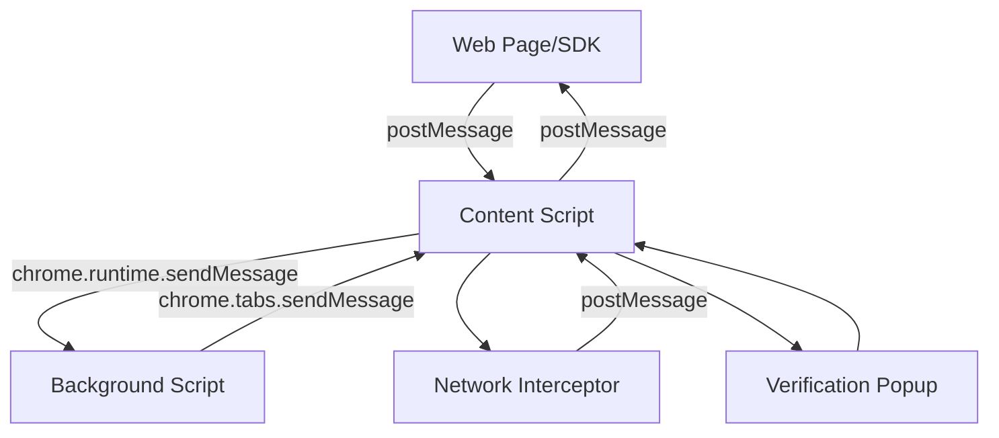

# Content Script Module

The content script module is responsible for running in the context of web pages and handling the core functionality of the Reclaim Browser Extension. It acts as a bridge between web pages, the Reclaim SDK, and the extension's background scripts.

## 📁 Folder Structure

```
src/content/
├── content.js              # Main content script entry point
├── components/             # UI components
│   └── ProviderVerificationPopup.js  # Verification popup UI
└── README.md              # This documentation
```

## 🔧 Core Functionality

### 1. Network Interception & Filtering
The content script coordinates with a network interceptor to capture and filter HTTP requests/responses based on provider-specific criteria.

**Key Features:**
- Intercepts network requests and responses via injected interceptor script
- Filters requests based on provider configuration
- Links requests with their corresponding responses
- Manages memory cleanup for intercepted data
- Automatically stops collection once all required requests are found

### 2. Provider Verification Popup
A sophisticated UI component that guides users through the verification process with real-time status updates.

**Features:**
- Responsive popup positioned at bottom-right of the page
- Multi-step verification flow with progress indicators
- Real-time status updates (claim creation, proof generation, submission)
- Error handling and retry mechanisms
- Modern glassmorphism design with animations

### 3. SDK Communication Bridge
Facilitates communication between the Reclaim SDK running on web pages and the extension's background scripts.

**Supported Actions:**
- Extension detection and health checks
- Verification process initiation
- Real-time status updates
- Proof delivery

## 🚀 Integration Guide

### Setting up Content Script in Your Extension

1. **Manifest Configuration** (manifest.json):
```json
{
  "content_scripts": [
    {
      "matches": ["<all_urls>"],
      "js": ["content/content.bundle.js"],
      "run_at": "document_start",
      "all_frames": false
    }
  ]
}
```

2. **Required Dependencies**:
- Network interceptor script (must be web-accessible)
- Background script for message handling
- Provider configuration data
- Logging service

### Environment Variables

Ensure these environment variables are set during build:

```bash
EXTENSION_ID=your-extension-id-here
```

This is used for security validation to ensure only your extension can communicate with the SDK.

### Message Flow Architecture



## 📨 Message Actions Reference

### SDK Actions (Web Page ↔ Content Script)
- `RECLAIM_EXTENSION_CHECK` - Check if extension is installed
- `RECLAIM_EXTENSION_RESPONSE` - Extension availability response
- `RECLAIM_START_VERIFICATION` - Start verification process
- `RECLAIM_VERIFICATION_STARTED` - Verification started confirmation
- `RECLAIM_VERIFICATION_COMPLETED` - Verification completed with proof
- `RECLAIM_VERIFICATION_FAILED` - Verification failed with error

### Internal Actions (Content Script ↔ Background Script)
- `CONTENT_SCRIPT_LOADED` - Notify content script is ready
- `SHOULD_INITIALIZE` - Check if content script should initialize
- `REQUEST_PROVIDER_DATA` - Request provider configuration
- `PROVIDER_DATA_READY` - Provider data available
- `SHOW_PROVIDER_VERIFICATION_POPUP` - Display verification UI
- `FILTERED_REQUEST_FOUND` - Matching network request found
- `INTERCEPTED_REQUEST/RESPONSE` - Network data captured

### Status Actions (Background Script → Content Script)
- `CLAIM_CREATION_REQUESTED` - Claim creation started
- `CLAIM_CREATION_SUCCESS/FAILED` - Claim creation result
- `PROOF_GENERATION_STARTED` - Proof generation started
- `PROOF_GENERATION_SUCCESS/FAILED` - Proof generation result
- `PROOF_SUBMITTED` - Proof successfully submitted
- `PROOF_SUBMISSION_FAILED` - Proof submission failed

## 🛠️ Customization Guide

### Modifying the Verification Popup

The popup component in `components/ProviderVerificationPopup.js` can be customized:

**Styling**: Modify the injected CSS in the `injectStyles()` function
**Content**: Update the HTML structure in `renderInitialContent()`
**Behavior**: Modify status handlers for different verification states

**Key Customization Points:**
```javascript
// Popup positioning
bottom: 20px;
right: 20px;

// Colors and theming
background-color: #2C2C2E;
color: #FFFFFF;

// Animation timing
transition: all 0.3s ease;
```

### Provider Configuration

Provider data structure expected by the content script:

```javascript
{
  httpProviderId: "string",
  name: "Provider Name",
  description: "Provider Description",
  loginUrl: "https://provider.com/login",
  requestData: [
    {
      url: "https://api.provider.com/user",
      method: "GET",
      responseMatches: [
        {
          value: "$.user.verified",
          type: "contains",
          invert: false
        }
      ]
    }
  ]
}
```

### Network Filtering Logic

Modify `filterRequest()` function in `../utils/claim-creator` to customize request filtering logic:

```javascript
// Example custom filter
const customFilter = (request, criteria, parameters) => {
  // Your custom filtering logic here
  return matchesCustomCriteria(request, criteria);
};
```

## 🔒 Security Considerations

1. **Extension ID Validation**: Always validate the extension ID to prevent unauthorized access
2. **Message Origin Validation**: Only accept messages from the same window/origin
3. **Data Sanitization**: Sanitize all data received from web pages
4. **Memory Management**: Clear sensitive data after use
5. **Network Data Handling**: Handle intercepted network data securely

## 🐛 Debugging & Troubleshooting

### Common Issues

1. **Content Script Not Loading**
   - Check manifest.json configuration
   - Verify content script is built and accessible
   - Check console for injection errors

2. **Network Interception Not Working**
   - Ensure interceptor script is web-accessible in manifest
   - Check script injection timing (should be document_start)
   - Verify network interceptor bundle exists

3. **Popup Not Displaying**
   - Check DOM readiness before injection
   - Verify CSS styles are properly injected
   - Check for CSS conflicts with host page

4. **SDK Communication Failing**
   - Verify extension ID matches environment variable
   - Check message format and action names
   - Ensure proper response handling

### Debug Logging

Enable debug logging by setting up the logger service:

```javascript
import { debugLogger, DebugLogType } from '../utils/logger';

debugLogger.log(DebugLogType.CONTENT, 'Your debug message here');
```

## 🔄 Extension Lifecycle

1. **Initialization**: Content script checks if it should initialize for current URL
2. **Injection**: Network interceptor is injected if initialization is required
3. **Configuration**: Provider data is requested from background script
4. **Collection**: Network requests are intercepted and filtered
5. **Verification**: Popup is displayed and manages verification flow
6. **Cleanup**: Resources are cleaned up after completion or timeout