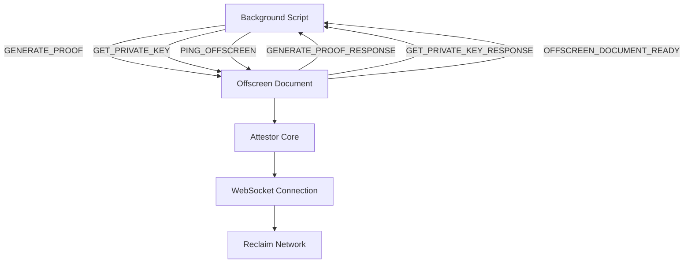

# Offscreen Document Module

The offscreen document module handles computationally intensive and security-sensitive operations that require DOM access but should not block the main extension threads. It serves as an isolated execution environment for cryptographic proof generation and private key operations.

## 📁 Folder Structure

```
src/offscreen/
├── offscreen.js              # Main offscreen document script
├── offscreen.html           # DOM context for offscreen operations
└── README.md               # This documentation
```

## 🔧 Core Functionality

### 1. Cryptographic Proof Generation
The primary function of the offscreen document is to generate zero-knowledge proofs using the Reclaim Protocol's attestor-core library.

**Key Features:**
- WebAssembly-based cryptographic operations
- Timeout protection (60-second limit)
- Session status tracking
- Error handling and recovery
- Memory-safe operations

### 2. Private Key Generation
Generates secure private keys using the browser's native crypto APIs.

**Features:**
- Uses `window.crypto.getRandomValues()` for entropy
- 256-bit private key generation
- Hex-encoded output format
- Secure random number generation

### 3. WebSocket Support
Provides native WebSocket access for the attestor-core library to communicate with Reclaim's infrastructure.

**Features:**
- Native browser WebSocket implementation
- Isolated network context
- Cross-origin communication support

## 🚀 Integration Guide

### Setting up Offscreen Document in Your Extension

1. **Manifest Configuration** (manifest.json):
```json
{
  "permissions": [
    "offscreen"
  ],
  "web_accessible_resources": [
    {
      "resources": [
        "offscreen/offscreen.html",
        "offscreen/offscreen.bundle.js"
      ],
      "matches": ["<all_urls>"]
    }
  ],
  "content_security_policy": {
    "extension_pages": "script-src 'self' 'wasm-unsafe-eval'; object-src 'self'; worker-src 'self';"
  }
}
```

2. **Required Dependencies**:
- `@reclaimprotocol/attestor-core` - Core proof generation library
- WebAssembly runtime support
- Custom WebSocket wrapper for offscreen context
- Session status management utilities

### Environment Setup

The offscreen document automatically configures:

```javascript
// WebAssembly path configuration
global.WASM_PATH = chrome.runtime.getURL('');

// Cross-Origin policies for SharedArrayBuffer support
Cros["main_frame", "sub_frame", "stylesheet", "script", "image", "font", "object", "xmlhttprequest", "ping", "csp_report", "media", "websocket", "webtransport", "webbundle", "other"]s-Origin-Embedder-Policy: require-corp
Cross-Origin-Opener-Policy: same-origin
```

### Message Flow Architecture



## 📨 Message Actions Reference

### Incoming Actions (Background Script → Offscreen Document)
- `PING_OFFSCREEN` - Health check and readiness verification
- `GENERATE_PROOF` - Generate cryptographic proof from claim data
- `GET_PRIVATE_KEY` - Generate a new private key

### Outgoing Actions (Offscreen Document → Background Script)
- `OFFSCREEN_DOCUMENT_READY` - Document initialized and ready
- `GENERATE_PROOF_RESPONSE` - Proof generation result (success/failure)
- `GET_PRIVATE_KEY_RESPONSE` - Private key generation result

## 🛠️ Customization Guide

### Modifying Proof Generation

The proof generation logic can be customized in the `generateProof()` method:

```javascript
async generateProof(claimData) {
  // Custom pre-processing
  const processedData = await this.preprocessClaimData(claimData);
  
  // Custom timeout (default: 60 seconds)
  const timeoutMs = 120000; // 2 minutes
  
  // Custom error handling
  try {
    const result = await createClaimOnAttestor(processedData);
    return this.postprocessResult(result);
  } catch (error) {
    throw new CustomProofError(error.message);
  }
}
```

### Custom Private Key Format

Modify the private key generation format:

```javascript
// Default: Hex format
const privateKey = '0x' + Array.from(randomBytes)
  .map(b => b.toString(16).padStart(2, '0')).join('');

// Custom: Base64 format
const privateKey = btoa(String.fromCharCode(...randomBytes));

// Custom: Different key length
const randomBytes = window.crypto.getRandomValues(new Uint8Array(64)); // 512-bit
```

### Session Status Integration

Customize session status updates:

```javascript
// Custom status types
const CUSTOM_STATUS = {
  PREPROCESSING_STARTED: 'CUSTOM_PREPROCESSING_STARTED',
  VALIDATION_COMPLETE: 'CUSTOM_VALIDATION_COMPLETE'
};

// Update session with custom status
await updateSessionStatus(sessionId, CUSTOM_STATUS.PREPROCESSING_STARTED);
```

## 🔒 Security Considerations

1. **Isolated Execution**: Offscreen documents run in isolation from web pages
2. **Memory Protection**: WebAssembly provides memory-safe operations
3. **Cross-Origin Policies**: COOP/COEP headers prevent unauthorized access
4. **Secure Random Generation**: Uses cryptographically secure random sources
5. **Timeout Protection**: Prevents infinite loops and resource exhaustion
6. **Error Sanitization**: Sensitive error details are not exposed

## 🐛 Debugging & Troubleshooting

### Common Issues

1. **Offscreen Document Not Creating**
   - Check manifest permissions include "offscreen"
   - Verify web_accessible_resources configuration
   - Ensure CSP allows 'wasm-unsafe-eval'

2. **WebAssembly Loading Failures**
   - Verify WASM files are accessible
   - Check WASM_PATH configuration
   - Ensure browser supports WebAssembly

3. **Proof Generation Timeouts**
   - Check network connectivity to Reclaim infrastructure
   - Verify WebSocket connections are not blocked
   - Monitor for memory pressure

4. **WebSocket Connection Issues**
   - Ensure offscreen-websocket wrapper is properly configured
   - Check for CORS/CSP restrictions
   - Verify network permissions

### Debug Logging

Enable debug logging for offscreen operations:

```javascript
import { debugLogger, DebugLogType } from '../utils/logger';

debugLogger.log(DebugLogType.OFFSCREEN, 'Your debug message here');
```

## 📊 Performance Considerations

1. **Memory Management**:
   - WebAssembly provides automatic memory management
   - Large proof data is cleaned up after generation
   - Session data is cleared on completion

2. **Processing Optimization**:
   - Proof generation uses worker threads where possible
   - Timeout prevents resource exhaustion
   - Efficient message passing with structured cloning

3. **Network Efficiency**:
   - WebSocket connections are reused when possible
   - Connection pooling for multiple proof requests
   - Retry logic with exponential backoff

## 🔄 Extension Lifecycle

1. **Creation**: Background script creates offscreen document when needed
2. **Initialization**: Document sends ready signal and configures environment
3. **Processing**: Handles proof generation and key generation requests
4. **Cleanup**: Automatically managed by Chrome's offscreen document lifecycle
5. **Persistence**: Document persists across service worker restarts


## ⚡ Advanced Configuration

### WebAssembly Optimization

```javascript
// Custom WASM configuration
if (typeof WebAssembly !== 'undefined') {
  // Enable SIMD if available
  const simdSupported = await WebAssembly.validate(
    new Uint8Array([0, 97, 115, 109, 1, 0, 0, 0])
  );
  
  if (simdSupported) {
    global.WASM_FEATURES = { simd: true };
  }
}
```

### Custom Headers Configuration

```javascript
// Additional security headers
const additionalHeaders = [
  { httpEquiv: 'Permissions-Policy', content: 'camera=(), microphone=()' },
  { httpEquiv: 'X-Content-Type-Options', content: 'nosniff' }
];

additionalHeaders.forEach(header => {
  const meta = document.createElement('meta');
  meta.httpEquiv = header.httpEquiv;
  meta.content = header.content;
  document.head.appendChild(meta);
});
```

### Proof Generation Optimization

```javascript
// Batch proof generation
class BatchProofGenerator extends OffscreenProofGenerator {
  async generateBatchProofs(claimDataArray) {
    const proofs = await Promise.allSettled(
      claimDataArray.map(data => this.generateProof(data))
    );
    
    return proofs.map((result, index) => ({
      index,
      success: result.status === 'fulfilled',
      proof: result.value,
      error: result.reason
    }));
  }
}
```
